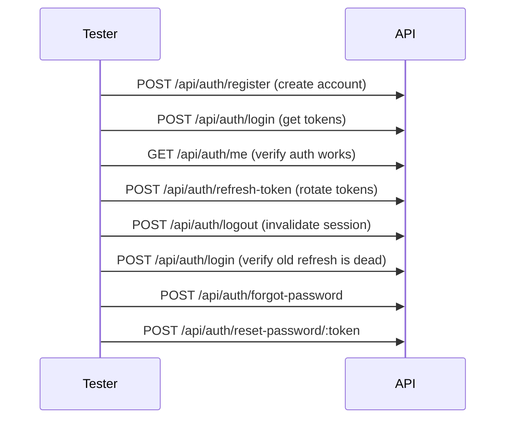

# Authentication Module — API Testing Guide

## Base URL

```
http://localhost:5000/api/auth
```

## Headers

```
Content-Type: application/json
```

Authenticated routes also require:

```
Authorization: Bearer <accessToken>
```

---

## 1. Register

Create a new customer account.

**Endpoint:** `POST /api/auth/register`

**Body:**
```json
{
  "firstName": "John",
  "lastName": "Doe",
  "email": "john@example.com",
  "phone": "01000000000",
  "password": "Password123"
}
```

**Success (201):**
```json
{
  "success": true,
  "message": "Registration successful",
  "data": {
    "user": {
      "id": "...",
      "firstName": "John",
      "lastName": "Doe",
      "email": "john@example.com",
      "role": "customer"
    },
    "accessToken": "eyJ...",
    "refreshToken": "eyJ..."
  }
}
```

**Errors:**
| Status | Condition |
|---|---|
| 400 | Email already registered |
| 400 | Validation error (missing fields, weak password) |

---

## 2. Login

Authenticate with email and password.

**Endpoint:** `POST /api/auth/login`

**Body:**
```json
{
  "email": "john@example.com",
  "password": "Password123"
}
```

**Success (200):**
```json
{
  "success": true,
  "message": "Login successful",
  "data": {
    "user": {
      "id": "...",
      "firstName": "John",
      "lastName": "Doe",
      "email": "john@example.com",
      "role": "customer"
    },
    "accessToken": "eyJ...",
    "refreshToken": "eyJ..."
  }
}
```

**Errors:**
| Status | Condition |
|---|---|
| 401 | Invalid email or password |
| 403 | Account is deactivated |

### Seed Admin Credentials
```
email:    admin@electropi.com
password: Password@123
role:     admin
```

---

## 3. Refresh Token

Get a new access/refresh token pair (JWT rotation invalidates the old refresh token).

**Endpoint:** `POST /api/auth/refresh-token`

**Body:**
```json
{
  "refreshToken": "eyJ..."
}
```

**Success (200):**
```json
{
  "success": true,
  "message": "Tokens refreshed",
  "data": {
    "accessToken": "eyJ...",
    "refreshToken": "eyJ..."
  }
}
```

---

## 4. Logout

Invalidate the refresh token. Requires authentication.

**Endpoint:** `POST /api/auth/logout`

**Headers:** `Authorization: Bearer <accessToken>`

**Body:**
```json
{
  "refreshToken": "eyJ..."
}
```

**Success (200):**
```json
{
  "success": true,
  "message": "Logged out successfully"
}
```

---

## 5. Get Current User

Returns the authenticated user's profile.

**Endpoint:** `GET /api/auth/me`

**Headers:** `Authorization: Bearer <accessToken>`

**Success (200):**
```json
{
  "success": true,
  "message": "Success",
  "data": {
    "user": {
      "_id": "...",
      "firstName": "John",
      "lastName": "Doe",
      "email": "john@example.com",
      "phone": "01000000000",
      "role": "customer",
      "provider": "local",
      "emailVerified": false,
      "active": true,
      "createdAt": "...",
      "updatedAt": "..."
    }
  }
}
```

---

## 6. Verify Email

**Endpoint:** `GET /api/auth/verify-email/:token`

**Success (200):**
```json
{
  "success": true,
  "message": "Email verified successfully"
}
```

---

## 7. Forgot Password

**Endpoint:** `POST /api/auth/forgot-password`

**Body:**
```json
{
  "email": "john@example.com"
}
```

**Success (200):**
```json
{
  "success": true,
  "message": "If that email exists, a reset link has been sent"
}
```

---

## 8. Reset Password

**Endpoint:** `POST /api/auth/reset-password/:token`

**Body:**
```json
{
  "password": "NewPassword456"
}
```

**Success (200):**
```json
{
  "success": true,
  "message": "Password reset successfully"
}
```

---

## Rate Limiting

Auth endpoints are rate-limited: **20 requests per 15 minutes** per IP.

---

## Test Flow (Recommended Order)


