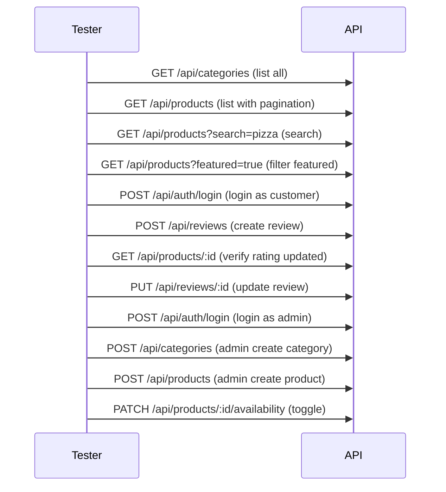

# Products Module — API Testing Guide

## Base URLs

```
http://localhost:5000/api/categories
http://localhost:5000/api/products
http://localhost:5000/api/reviews
```

## Categories

### 1. Get All Categories (Public)

**Endpoint:** `GET /api/categories`

**Success (200):**
```json
{
  "success": true,
  "data": {
    "categories": [
      {
        "_id": "...",
        "name": { "en": "Pizza", "ar": "بيتزا" },
        "image": "https://res.cloudinary.com/...",
        "active": true,
        "sortOrder": 1
      }
    ]
  }
}
```

### 2. Get Category By ID (Public)

**Endpoint:** `GET /api/categories/:categoryId`

### 3. Create Category (Admin)

**Endpoint:** `POST /api/categories`

**Headers:** `Authorization: Bearer <adminAccessToken>`

**Body:**
```json
{
  "name": { "en": "Pasta", "ar": "باستا" },
  "image": "https://res.cloudinary.com/...",
  "active": true,
  "sortOrder": 6
}
```

### 4. Update Category (Admin)

**Endpoint:** `PUT /api/categories/:categoryId`

**Headers:** `Authorization: Bearer <adminAccessToken>`

### 5. Delete Category (Admin)

**Endpoint:** `DELETE /api/categories/:categoryId`

**Headers:** `Authorization: Bearer <adminAccessToken>`

---

## Products

### 1. List Products (Public)

**Endpoint:** `GET /api/products`

**Query Parameters:**
| Param | Type | Description |
|---|---|---|
| `category` | ObjectId | Filter by category ID |
| `search` | string | Search in `name.en`, `name.ar`, `tags` |
| `featured` | boolean | Filter featured products |
| `available` | boolean | Filter by availability |
| `minPrice` | number | Minimum price |
| `maxPrice` | number | Maximum price |
| `tags` | string | Comma-separated tags |
| `sort` | string | `price`, `-price`, `createdAt`, `-createdAt`, `averageRating`, `-averageRating` |
| `page` | number | Page number (default: 1) |
| `limit` | number | Items per page (default: 20, max: 100) |

**Examples:**

Get all products:
```
GET /api/products
```

Search products:
```
GET /api/products?search=burger
```

Filter by category + price range:
```
GET /api/products?category=ID_HERE&minPrice=50&maxPrice=150
```

Featured + sorted by rating:
```
GET /api/products?featured=true&sort=-averageRating
```

Paginated:
```
GET /api/products?page=1&limit=10
```

**Success (200):**
```json
{
  "success": true,
  "data": {
    "products": [
      {
        "_id": "...",
        "category": { "_id": "...", "name": { "en": "Burgers", "ar": "برجر" }, "image": "..." },
        "name": { "en": "Chicken Burger", "ar": "برجر فراخ" },
        "price": 120,
        "image": "https://res.cloudinary.com/...",
        "featured": true,
        "available": true,
        "averageRating": 0,
        "reviewCount": 0
      }
    ]
  },
  "pagination": {
    "total": 22,
    "page": 1,
    "limit": 20,
    "totalPages": 2
  }
}
```

### 2. Get Product By ID (Public)

**Endpoint:** `GET /api/products/:productId`

### 3. Create Product (Admin)

**Endpoint:** `POST /api/products`

**Headers:** `Authorization: Bearer <adminAccessToken>`

**Body:**
```json
{
  "category": "CATEGORY_ID",
  "name": { "en": "New Burger", "ar": "برجر جديد" },
  "description": { "en": "Delicious new burger", "ar": "برجر جديد لذيذ" },
  "image": "https://res.cloudinary.com/...",
  "price": 99,
  "featured": false,
  "available": true,
  "tags": ["burger", "beef"]
}
```

### 4. Update Product (Admin)

**Endpoint:** `PUT /api/products/:productId`

**Headers:** `Authorization: Bearer <adminAccessToken>`

### 5. Delete Product (Admin)

**Endpoint:** `DELETE /api/products/:productId`

**Headers:** `Authorization: Bearer <adminAccessToken>`

### 6. Toggle Availability (Admin)

**Endpoint:** `PATCH /api/products/:productId/availability`

**Headers:** `Authorization: Bearer <adminAccessToken>`

Toggles `available` between `true`/`false`.

**Success (200):**
```json
{
  "success": true,
  "message": "Availability toggled",
  "data": {
    "product": {
      "_id": "...",
      "available": false
    }
  }
}
```

---

## Reviews

### 1. List Reviews (Public)

**Endpoint:** `GET /api/reviews`

**Query Parameters:**
| Param | Type | Description |
|---|---|---|
| `product` | ObjectId | Filter by product |
| `user` | ObjectId | Filter by user |
| `page` | number | Default: 1 |
| `limit` | number | Default: 20 |

### 2. Get Review By ID (Public)

**Endpoint:** `GET /api/reviews/:reviewId`

### 3. Create Review (Authenticated)

**Endpoint:** `POST /api/reviews`

**Headers:** `Authorization: Bearer <customerAccessToken>`

**Body:**
```json
{
  "product": "PRODUCT_ID",
  "rating": 4,
  "comment": "Great food!"
}
```

**Rules:**
- One review per user per product (enforced at database level with unique compound index)
- Rating must be between 1 and 5

**Success (201):**
```json
{
  "success": true,
  "message": "Review created",
  "data": {
    "review": {
      "_id": "...",
      "user": "...",
      "product": "...",
      "rating": 4,
      "comment": "Great food!"
    }
  }
}
```

When a review is created/updated/deleted, the product's `averageRating` and `reviewCount` are automatically recalculated.

### 4. Update Review (Owner only)

**Endpoint:** `PUT /api/reviews/:reviewId`

**Headers:** `Authorization: Bearer <reviewOwnerAccessToken>`

```json
{
  "rating": 5,
  "comment": "Amazing!"
}
```

### 5. Delete Review (Owner only)

**Endpoint:** `DELETE /api/reviews/:reviewId`

**Headers:** `Authorization: Bearer <reviewOwnerAccessToken>`

---

## Test Flow (Recommended Order)



## Seeded Data

| Collection | Count |
|---|---|
| Categories | 5 (Pizza, Burgers, Sandwiches, Drinks, Desserts) |
| Products | 22 (distributed across all categories, 6 featured) |
| Reviews | 0 (create via API) |
