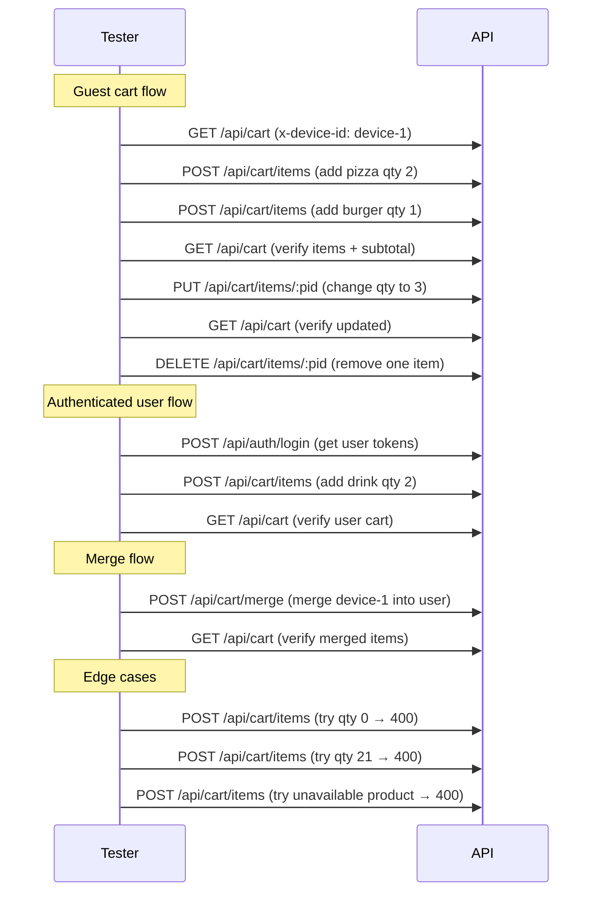

# Cart Module — API Testing Guide

## Base URL

```
http://localhost:5000/api/cart
```

## Headers

```
Content-Type: application/json
```

For **guest users** (no login required), send:

```
x-device-id: unique-device-identifier-123
```

For **authenticated users**, send:

```
Authorization: Bearer <accessToken>
```

If both are provided, the authenticated user takes priority.

---

## 1. Get Cart

Returns the current cart. Creates an empty cart if none exists.

**Endpoint:** `GET /api/cart`

**Guest request:**
```
GET /api/cart
x-device-id: guest-device-123
```

**Authenticated request:**
```
GET /api/cart
Authorization: Bearer <accessToken>
```

**Success (200):**
```json
{
  "success": true,
  "data": {
    "cart": {
      "_id": "...",
      "items": [],
      "subtotal": 0,
      "createdAt": "...",
      "updatedAt": "..."
    }
  }
}
```

---

## 2. Add Item to Cart

Add a product or increase quantity if already in cart.

**Endpoint:** `POST /api/cart/items`

**Body:**
```json
{
  "product": "PRODUCT_ID",
  "quantity": 2
}
```

**Rules checked by the service:**
| Rule | Behavior |
|---|---|
| Product exists | 404 if not found |
| Product available | 400 if `available: false` |
| Quantity min | 1 (enforced by validation) |
| Quantity max | 20 per product |
| Already in cart | Quantities are summed (capped at 20) |
| Price used | `discountedPrice` if set, otherwise `price` |

**Success (200):**
```json
{
  "success": true,
  "message": "Item added to cart",
  "data": {
    "cart": {
      "_id": "...",
      "items": [
        {
          "product": {
            "_id": "PRODUCT_ID",
            "name": { "en": "Chicken Burger", "ar": "برجر فراخ" },
            "price": 120,
            "image": "https://..."
          },
          "quantity": 2,
          "unitPrice": 120,
          "totalPrice": 240
        }
      ],
      "subtotal": 240
    }
  }
}
```

---

## 3. Update Item Quantity

**Endpoint:** `PUT /api/cart/items/:productId`

**Body:**
```json
{
  "quantity": 5
}
```

**Success (200):**
```json
{
  "success": true,
  "message": "Item updated"
}
```

---

## 4. Remove Item from Cart

**Endpoint:** `DELETE /api/cart/items/:productId`

**Success (200):**
```json
{
  "success": true,
  "message": "Item removed from cart"
}
```

---

## 5. Clear Cart

Removes all items from the cart.

**Endpoint:** `DELETE /api/cart`

**Success (200):**
```json
{
  "success": true,
  "message": "Cart cleared",
  "data": {
    "cart": {
      "_id": "...",
      "items": [],
      "subtotal": 0
    }
  }
}
```

---

## 6. Merge Guest Cart (On Login)

After a guest logs in, merge their guest cart items into their user cart. Requires authentication.

**Endpoint:** `POST /api/cart/merge`

**Headers:** `Authorization: Bearer <accessToken>`

**Body:**
```json
{
  "guestId": "guest-device-123"
}
```

**Merge rules:**
- Only available products are merged (unavailable ones are skipped)
- If product already exists in user cart → quantities are summed (capped at 20)
- If product is new → pushed as a new item
- Guest cart is deleted after merge

**Success (200):**
```json
{
  "success": true,
  "message": "Guest cart merged",
  "data": {
    "cart": {
      "_id": "...",
      "items": [...],
      "subtotal": 220
    }
  }
}
```

---

## Test Flow (Recommended Order)


