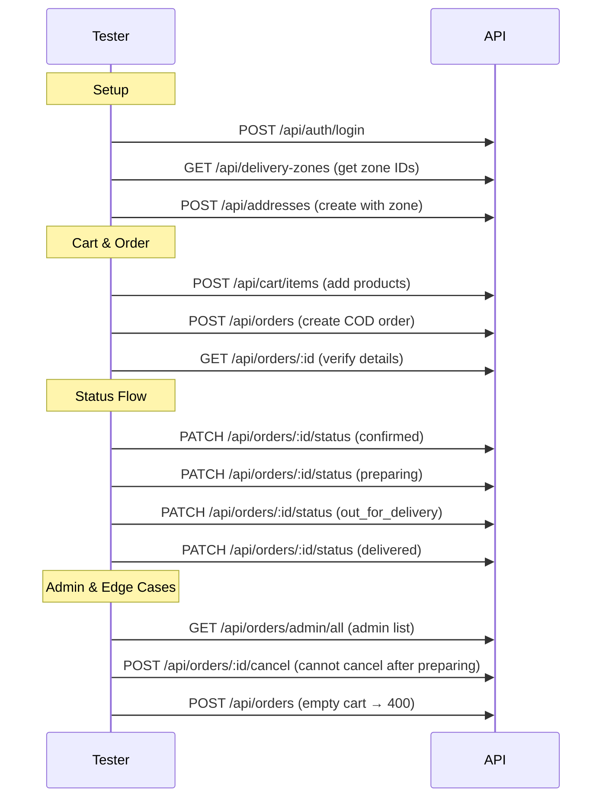

# Orders Module — API Testing Guide

## Base URLs

```
http://localhost:5000/api/orders
http://localhost:5000/api/payments
http://localhost:5000/api/addresses
```

## Prerequisites

Before creating an order, you need:
1. An **address** with a `zone` assigned (delivery zone determines fee)
2. **Items in your cart**

---

## 1. Addresses

### Create Address (Authenticated)

**Endpoint:** `POST /api/addresses`

**Headers:** `Authorization: Bearer <accessToken>`

```json
{
  "title": "Home",
  "phone": "01000000000",
  "street": "Main St",
  "building": "5",
  "floor": "3",
  "apartment": "12",
  "zone": "DELIVERY_ZONE_ID",
  "isDefault": true
}
```

### List My Addresses (Authenticated)

**Endpoint:** `GET /api/addresses`

### Get Address (Authenticated)

**Endpoint:** `GET /api/addresses/:addressId`

### Update Address (Authenticated)

**Endpoint:** `PUT /api/addresses/:addressId`

### Delete Address (Authenticated)

**Endpoint:** `DELETE /api/addresses/:addressId`

---

## 2. Create Order (COD)

**Endpoint:** `POST /api/orders`

**Headers:** `Authorization: Bearer <accessToken>`

**Body:**
```json
{
  "addressId": "ADDRESS_ID",
  "paymentMethod": "cod",
  "notes": "Leave at door"
}
```

**Flow executed by the service:**

```
1. Fetch user's cart (must not be empty)
2. Validate address belongs to user
3. Look up address.zone → apply zone.fee (or fallback default zone)
4. Calculate subtotal from cart items (uses discountedPrice if set)
5. Remove unavailable products from items
6. totalAmount = subtotal + deliveryFee - discount
7. Create Order with statusHistory[placed]
8. Clear cart items
9. Emit socket event: admin room receives 'new_order'
```

**Success (201):**
```json
{
  "success": true,
  "message": "Order created",
  "data": {
    "order": {
      "_id": "...",
      "user": "...",
      "address": { "_id": "...", "title": "Home", "street": "Main St" },
      "items": [
        {
          "product": { "_id": "...", "name": { "en": "Chicken Burger" }, "price": 120 },
          "quantity": 2,
          "price": 120
        }
      ],
      "subtotal": 240,
      "deliveryFee": 25,
      "discountAmount": 0,
      "totalAmount": 265,
      "paymentMethod": "cod",
      "paymentStatus": "pending",
      "orderStatus": "placed",
      "statusHistory": [{ "status": "placed", "changedAt": "..." }]
    }
  }
}
```

## 3. Create Order with Coupon

**Body:**
```json
{
  "addressId": "ADDRESS_ID",
  "couponCode": "WELCOME10",
  "paymentMethod": "cod"
}
```

**Coupon validation (in order):**
| Condition | Result |
|---|---|
| Not found | 400 |
| `active: false` | 400 |
| `expiresAt < now` | 400 |
| `usedCount >= usageLimit` | 400 |
| `subtotal < minOrderAmount` | 400 |
| Fixed type | `discount = value` (capped at subtotal) |
| Percentage type | `discount = subtotal * value / 100` (capped at maxDiscount) |
| Valid | Discount applied, `usedCount++` |

## 4a. Create Order (COD)

**Body:**
```json
{
  "addressId": "ADDRESS_ID",
  "paymentMethod": "cod"
}
```

**Success (201):**
```json
{
  "success": true,
  "data": {
    "order": { ... }
  }
}
```

---

## 4b. Create Order (Paymob)

**Body:**
```json
{
  "addressId": "ADDRESS_ID",
  "paymentMethod": "paymob"
}
```

**Success (201)** — returns Paymob checkout URL:
```json
{
  "success": true,
  "data": {
    "order": { ... },
    "clientSecret": "paymob_client_secret...",
    "checkoutUrl": "https://accept.paymob.com/unifiedcheckout/?public_key=...&client_secret=..."
  }
}
```

**Frontend flow:**
1. Send `paymentMethod: "paymob"` in the order request
2. Receive `clientSecret` and `checkoutUrl`
3. Redirect user to `checkoutUrl` (Paymob hosted checkout page)
4. User completes payment on Paymob's page
5. Paymob redirects user back to your success/cancel URL
6. Paymob sends a webhook callback to your backend to confirm the transaction

---

## 5. Get My Orders (Authenticated)

**Endpoint:** `GET /api/orders`

**Headers:** `Authorization: Bearer <accessToken>`

**Query Parameters:**
| Param | Type |
|---|---|
| `orderStatus` | `placed`, `confirmed`, `preparing`, `out_for_delivery`, `delivered`, `cancelled` |
| `paymentStatus` | `pending`, `paid`, `failed` |
| `startDate` | ISO date |
| `endDate` | ISO date |
| `page` | Default: 1 |
| `limit` | Default: 20 |

---

## 6. Get Order By ID (Authenticated)

**Endpoint:** `GET /api/orders/:orderId`

**Headers:** `Authorization: Bearer <accessToken>` (owner or admin)

---

## 7. Cancel Order (Owner)

**Endpoint:** `POST /api/orders/:orderId/cancel`

**Headers:** `Authorization: Bearer <accessToken>`

**Allowed only when status is:** `placed` or `confirmed`

---

## 8. Update Order Status (Admin)

**Endpoint:** `PATCH /api/orders/:orderId/status`

**Headers:** `Authorization: Bearer <adminAccessToken>`

**Body:**
```json
{
  "orderStatus": "confirmed"
}
```

**Valid transitions:**
```
placed → confirmed → preparing → out_for_delivery → delivered
placed / confirmed → cancelled
```

**Side effects:**
- Each change pushes to `statusHistory[]` with timestamp
- If `delivered` and `cod` → `paymentStatus` set to `paid`
- Emits socket event `order_status_updated` to user's room
- Logs audit action `ORDER_STATUS_UPDATED`

---

## 9. Admin: List All Orders

**Endpoint:** `GET /api/orders/admin/all`

**Headers:** `Authorization: Bearer <adminAccessToken>`

Same query params as user listing. Includes user details in response.

---

## 10. Edge Cases

| Scenario | Expected |
|---|---|
| Empty cart | 400 — "Cart is empty" |
| Address not found | 400 |
| Address belongs to another user | 400 |
| Invalid status transition | 400 — "Cannot transition from X to Y" |
| Cancel after preparing | 400 — "Order cannot be cancelled at this stage" |
| Coupon expired | 400 — "Coupon has expired" |
| Coupon exhausted | 400 — "Coupon usage limit reached" |
| All cart items unavailable | 400 — "No available products in cart" |

---

## Test Flow (Recommended Order)


