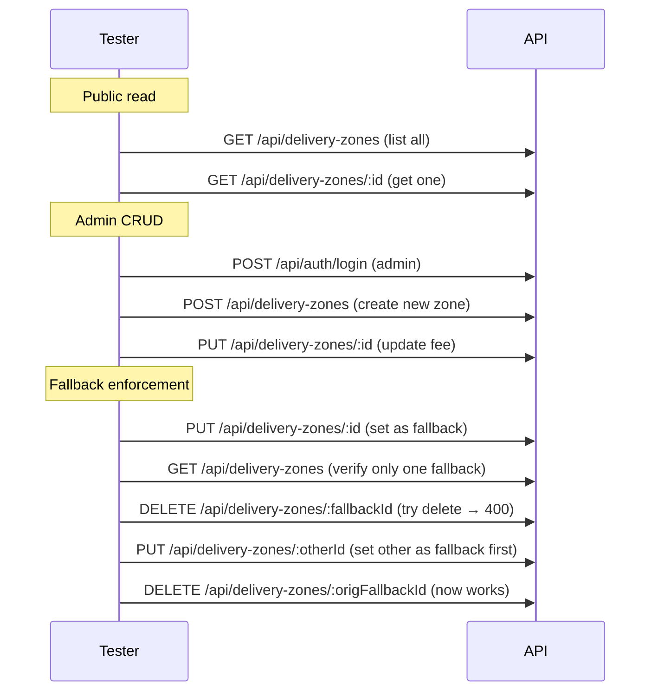

# Delivery Zones Module — API Testing Guide

## Base URL

```
http://localhost:5000/api/delivery-zones
```

## Public Endpoints (No Auth Required)

### 1. List Zones

**Endpoint:** `GET /api/delivery-zones`

**Query Parameters:**
| Param | Type | Description |
|---|---|---|
| `active` | boolean | Filter by active status |
| `sort` | string | `fee`, `-fee`, `name`, `-name` (default: fee ascending) |

**Success (200):**
```json
{
  "success": true,
  "data": {
    "zones": [
      {
        "_id": "...",
        "name": { "en": "Maadi", "ar": "المعادي" },
        "fee": 25,
        "estimatedMinutes": 25,
        "active": true,
        "isDefaultFallback": false
      },
      {
        "_id": "...",
        "name": { "en": "Default", "ar": "الافتراضي" },
        "fee": 50,
        "estimatedMinutes": 60,
        "active": true,
        "isDefaultFallback": true
      }
    ]
  }
}
```

### 2. Get Zone By ID

**Endpoint:** `GET /api/delivery-zones/:zoneId`

---

## Admin Endpoints (Require Authentication)

**Headers:** `Authorization: Bearer <adminAccessToken>`

### 3. Create Zone

**Endpoint:** `POST /api/delivery-zones`

**Body:**
```json
{
  "name": { "en": "New Cairo", "ar": "القاهرة الجديدة" },
  "fee": 40,
  "estimatedMinutes": 30,
  "active": true,
  "isDefaultFallback": false
}
```

### 4. Update Zone

**Endpoint:** `PUT /api/delivery-zones/:zoneId`

**Body:** (partial updates allowed)
```json
{
  "fee": 45,
  "isDefaultFallback": true
}
```

### 5. Delete Zone

**Endpoint:** `DELETE /api/delivery-zones/:zoneId`

---

## Fallback Zone Rules

The system enforces these rules automatically in the service layer:

| Rule | Description |
|---|---|
| **Exactly one fallback** | When a zone is marked `isDefaultFallback: true`, all other zones are unset |
| **Highest fee enforced** | The fallback zone's fee is automatically bumped to be higher than any other zone |
| **Cannot delete the only fallback** | Returns 400 — set another zone as fallback first |
| **Cannot unset the only fallback** | Returns 400 — set another zone as fallback first |

### Fallback Fee Auto-Bump Example

```
Before:
  Heliopolis: fee=35
  Default: fee=50 (fallback)

Set New Cairo (fee=40) as fallback:
  Default: fee=50 → isDefaultFallback=false
  New Cairo: fee=40 → isDefaultFallback=true → auto-bumped to 51

Result:
  New Cairo: fee=51 (fallback) ← highest fee
  Default: fee=50
```

---

## Edge Cases

| Scenario | Expected |
|---|---|
| List without auth | Returns all active zones |
| Create zone with same name | Allowed (no unique constraint) |
| Set second zone as fallback | First fallback auto-unset |
| Delete the only fallback | **400** — "Cannot delete the only fallback zone" |
| Unset the only fallback without replacement | **400** — "Cannot remove the only fallback zone" |
| Create zone with fee higher than fallback | Fallback fee auto-bumped to be higher |
| Non-admin creates zone | **403** — Forbidden |
| Admin creates zone with invalid data | **400** — Validation error |

---

## Usage in Other Modules

The delivery zones are consumed in two places:

1. **Address creation** — Users select a zone for their delivery address
2. **Order checkout** — `order.service.js:calculateDeliveryFee()` looks up the address's zone and applies the fee. If no zone is found or the zone is inactive, it falls back to the default fallback zone (highest fee).

---

## Test Flow


