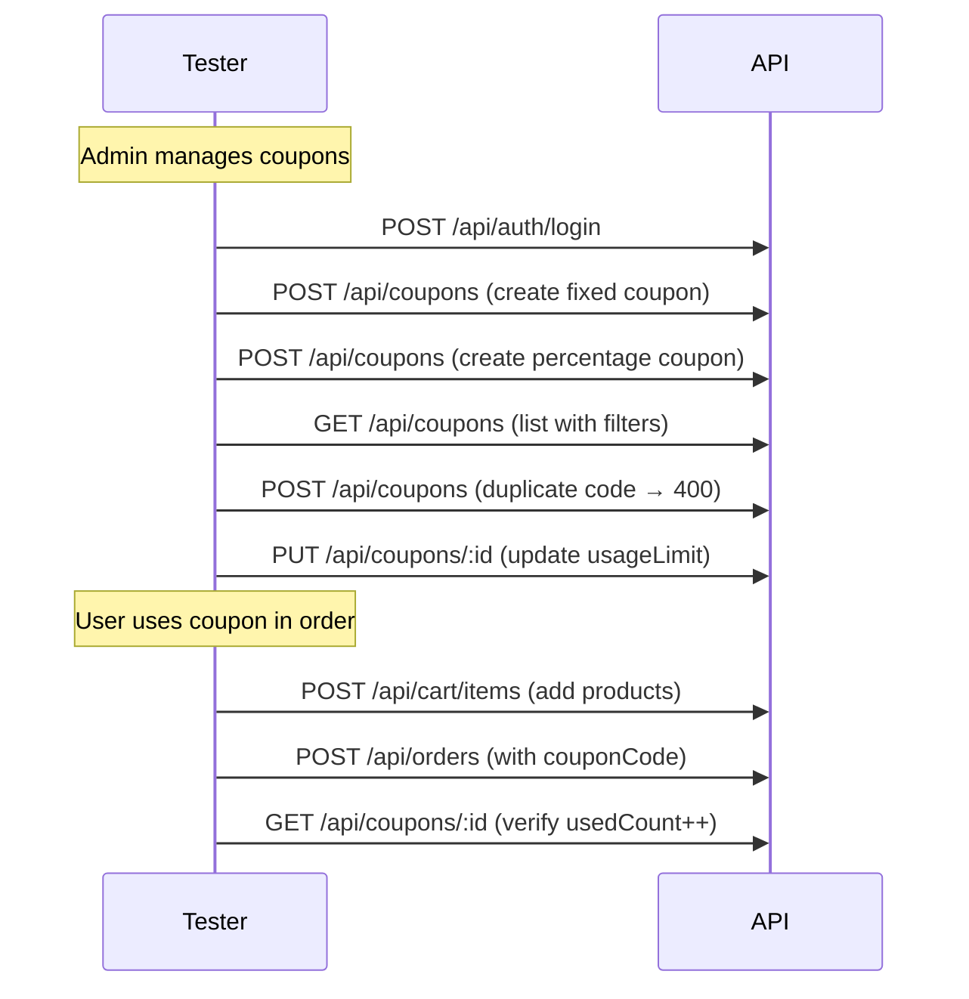

# Coupons Module — API Testing Guide

## Base URL

```
http://localhost:5000/api/coupons
```

**All coupon management endpoints require admin authentication.**

```
Authorization: Bearer <adminAccessToken>
```

---

## 1. Create Coupon (Admin)

**Endpoint:** `POST /api/coupons`

**Body:**
```json
{
  "code": "WELCOME10",
  "type": "percentage",
  "value": 10,
  "maxDiscount": 50,
  "minOrderAmount": 100,
  "usageLimit": 100,
  "active": true,
  "expiresAt": "2027-12-31T23:59:59.000Z"
}
```

**Validation Rules:**

| Field | Rule |
|---|---|
| `code` | Required, uppercase, 3-20 chars, unique |
| `type` | Required, `fixed` or `percentage` |
| `value` | Required, min 0 |
| `maxDiscount` | Only applies to percentage type. 0 = no cap |
| `minOrderAmount` | Default 0 |
| `usageLimit` | 0 = unlimited |
| `active` | Default true |
| `expiresAt` | Optional |

**Success (201):**
```json
{
  "success": true,
  "message": "Coupon created",
  "data": {
    "coupon": {
      "_id": "...",
      "code": "WELCOME10",
      "type": "percentage",
      "value": 10,
      "maxDiscount": 50,
      "minOrderAmount": 100,
      "usageLimit": 100,
      "usedCount": 0,
      "active": true,
      "expiresAt": "2027-12-31T23:59:59.000Z"
    }
  }
}
```

### Fixed Coupon Example
```json
{
  "code": "SAVE20",
  "type": "fixed",
  "value": 20,
  "minOrderAmount": 50,
  "usageLimit": 50
}
```

### Percentage Coupon (No Max)
```json
{
  "code": "HALFOFF",
  "type": "percentage",
  "value": 50,
  "minOrderAmount": 200
}
```

---

## 2. List Coupons (Admin)

**Endpoint:** `GET /api/coupons`

**Query Parameters:**
| Param | Type | Description |
|---|---|---|
| `active` | boolean | Filter by active status |
| `type` | string | `fixed` or `percentage` |
| `search` | string | Regex match on coupon code |
| `page` | number | Default: 1 |
| `limit` | number | Default: 20 |

---

## 3. Get Coupon By ID (Admin)

**Endpoint:** `GET /api/coupons/:couponId`

---

## 4. Update Coupon (Admin)

**Endpoint:** `PUT /api/coupons/:couponId`

**Body (partial):**
```json
{
  "active": false,
  "usageLimit": 200
}
```

---

## 5. Delete Coupon (Admin)

**Endpoint:** `DELETE /api/coupons/:couponId`

---

## 6. Using Coupons in Orders

Coupons are applied during order checkout. See [Orders Module](04-orders.md#3-create-order-with-coupon).

**Endpoint:** `POST /api/orders`

```json
{
  "addressId": "ADDRESS_ID",
  "couponCode": "PCT10",
  "paymentMethod": "cod"
}
```

### Coupon Validation (in `order.service.js`)

| Check | Condition | Response |
|---|---|---|
| Exists | Coupon code found in DB | 400 — "Coupon not found" |
| Active | `active: true` | 400 — "Coupon is inactive" |
| Expiration | `expiresAt > Date.now()` | 400 — "Coupon has expired" |
| Usage limit | `usedCount < usageLimit` | 400 — "Coupon usage limit reached" |
| Min order | `subtotal >= minOrderAmount` | 400 — "Minimum order amount is X" |
| Fixed calc | `discount = min(value, subtotal)` | Applied |
| Percentage calc | `discount = min(subtotal * value / 100, maxDiscount)` | Applied |
| After apply | `usedCount++` | Persisted |

### Discount Calculation Examples

| Scenario | Subtotal | Coupon | Discount | Total |
|---|---|---|---|---|
| Fixed | 500 | `SAVE20` (fixed 20) | 20 | 480 + fee |
| Percentage | 400 | `PCT10` (10%, max 50) | 40 | 360 + fee |
| Percentage capped | 1000 | `PCT10` (10%, max 50) | 50 | 950 + fee |
| Fixed exceeds subtotal | 15 | `SAVE20` (fixed 20) | 15 | 0 + fee |

---

## Edge Cases

| Scenario | Expected |
|---|---|
| Duplicate coupon code | **400** — "Coupon code already exists" |
| `usageLimit: 0` | Treated as unlimited |
| No `expiresAt` | No expiration date (valid forever) |
| `maxDiscount: 0` for percentage | No cap on discount |
| `value: 0` | Valid — coupon gives zero discount (edge case) |
| Delete used coupon | Allowed — existing orders keep their discount |
| Update `usageLimit` below `usedCount` | Next usage attempt will fail at checkout |
| Create with lowercase code | Auto-uppercased by schema |
| Non-admin tries to access | **403** — Forbidden |

---

## Test Flow


