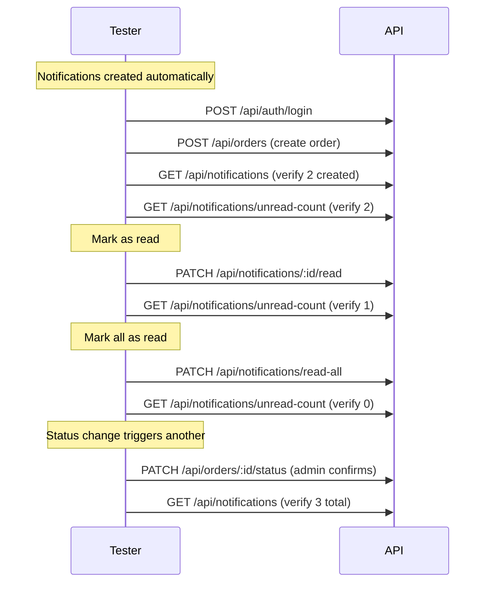

# Notifications Module — API Testing Guide

## Base URL

```
http://localhost:5000/api/notifications
```

**All endpoints require authentication.**

```
Authorization: Bearer <accessToken>
```

---

## 1. List Notifications

**Endpoint:** `GET /api/notifications`

**Query Parameters:**
| Param | Type | Description |
|---|---|---|
| `read` | boolean | Filter by read status |
| `page` | number | Default: 1 |
| `limit` | number | Default: 20 |

**Success (200):**
```json
{
  "success": true,
  "data": {
    "notifications": [
      {
        "_id": "...",
        "user": "...",
        "title": { "en": "Order Placed", "ar": "تم تقديم الطلب" },
        "message": {
          "en": "Your order #... has been placed. Total: 105 EGP",
          "ar": "تم تقديم طلبك #.... الإجمالي: 105 جنيه"
        },
        "type": "order_placed",
        "read": false,
        "createdAt": "..."
      }
    ]
  },
  "pagination": {
    "total": 2,
    "page": 1,
    "limit": 20,
    "totalPages": 1
  }
}
```

---

## 2. Get Unread Count

**Endpoint:** `GET /api/notifications/unread-count`

**Success (200):**
```json
{
  "success": true,
  "data": { "count": 5 }
}
```

---

## 3. Mark One as Read

**Endpoint:** `PATCH /api/notifications/:notificationId/read`

**Success (200):**
```json
{
  "success": true,
  "message": "Marked as read",
  "data": {
    "notification": {
      "_id": "...",
      "read": true
    }
  }
}
```

---

## 4. Mark All as Read

**Endpoint:** `PATCH /api/notifications/read-all`

Marks every unread notification for the authenticated user as read.

**Success (200):**
```json
{
  "success": true,
  "message": "All notifications marked as read"
}
```

---

## 5. Delete Notification

**Endpoint:** `DELETE /api/notifications/:notificationId`

---

## Automatic Notifications (Triggered by System)

Notifications are automatically created when these events happen:

| Event | User Receives | Title (en) | Type |
|---|---|---|---|
| Order placed | Customer | "Order Placed" | `order_placed` |
| Order placed | All admins | "New Order" | `new_order` |
| Status → confirmed | Customer | "Order Updated" | `order_status` |
| Status → preparing | Customer | "Order Updated" | `order_status` |
| Status → out_for_delivery | Customer | "Order Updated" | `order_status` |
| Status → delivered | Customer | "Order Updated" | `order_status` |
| Order cancelled | Customer | "Order Updated" | `order_status` |

Each notification also emits a **socket event** `notification_received` to `user:{userId}` room on creation.

---

## Edge Cases

| Scenario | Expected |
|---|---|
| List with `read: false` filter | Only unread returned |
| List with `read: true` filter | Only read returned |
| No notifications at all | Empty array, `total: 0` |
| Mark already-read notification | 200 — idempotent |
| Mark all with zero unread | 200 — nothing changes |
| Delete other user's notification | 404 (scoped by user) |
| Create order → 2 notifications created | Customer + admin both notified |
| Update order status → 1 notification created | Customer notified |

---

## Socket.IO Events

When a notification is created, the server emits:

```json
// Event: "notification_received"
// Room: user:{userId}

{
  "notification": {
    "_id": "...",
    "title": { "en": "Order Placed", "ar": "..." },
    "message": { "en": "...", "ar": "..." },
    "type": "order_placed",
    "read": false
  }
}
```

The client listens on its user room (joined via `socket.emit('join', userId)`) and can display a badge or toast.

---

## Test Flow


