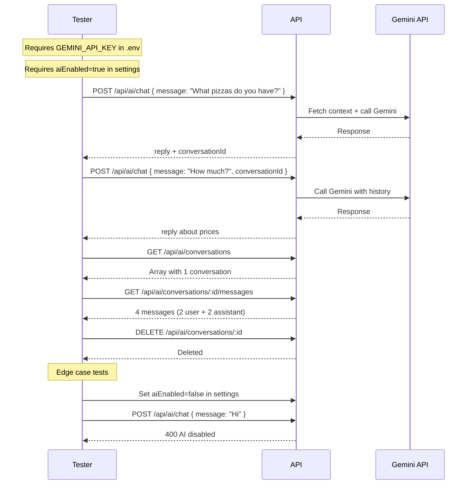

# AI Assistant Module — API Testing Guide

## Base URL

```
http://localhost:5000/api/ai
```

**All endpoints require authentication.**

```
Authorization: Bearer <accessToken>
```

---

## 1. Chat with AI

**Endpoint:** `POST /api/ai/chat`

**Request Body:**

| Field | Type | Required | Description |
|---|---|---|---|
| `message` | string | Yes | User message (1-2000 chars) |
| `conversationId` | string | No | Existing conversation ID to continue |

**New conversation (first message):**
```json
{
  "message": "What pizzas do you have?"
}
```

**Success (201):**
```json
{
  "success": true,
  "message": "Success",
  "data": {
    "reply": "We have Margherita Pizza (80 EGP) and Pepperoni Pizza (100 EGP). Both are available! Would you like to know more about any of them?",
    "conversationId": "665a1b2c3d4e5f6a7b8c9d0e"
  }
}
```

**Continuing a conversation:**
```json
{
  "message": "What are your working hours?",
  "conversationId": "665a1b2c3d4e5f6a7b8c9d0e"
}
```

**Success (200):**
```json
{
  "success": true,
  "message": "Success",
  "data": {
    "reply": "We are open from 10:00 AM to 11:00 PM every day. You can visit us or order online!",
    "conversationId": "665a1b2c3d4e5f6a7b8c9d0e"
  }
}
```

**Arabic message:**
```json
{
  "message": "ما عندكم من بيتزا؟"
}
```

**Expected:** AI responds in Arabic with pizza menu.

---

## 2. List Conversations

**Endpoint:** `GET /api/ai/conversations`

**Success (200):**
```json
{
  "success": true,
  "message": "Success",
  "data": {
    "conversations": [
      {
        "_id": "665a1b2c3d4e5f6a7b8c9d0e",
        "createdAt": "2026-06-24T03:30:00.000Z",
        "updatedAt": "2026-06-24T03:35:00.000Z",
        "lastMessage": "We are open from 10:00 AM to 11:00 PM every day."
      }
    ]
  }
}
```

---

## 3. Get Conversation Messages

**Endpoint:** `GET /api/ai/conversations/:conversationId/messages`

**Success (200):**
```json
{
  "success": true,
  "message": "Success",
  "data": {
    "messages": [
      {
        "_id": "...",
        "conversation": "665a1b2c3d4e5f6a7b8c9d0e",
        "role": "user",
        "content": "What pizzas do you have?",
        "createdAt": "2026-06-24T03:30:00.000Z"
      },
      {
        "_id": "...",
        "conversation": "665a1b2c3d4e5f6a7b8c9d0e",
        "role": "assistant",
        "content": "We have Margherita Pizza (80 EGP) and Pepperoni Pizza (100 EGP)...",
        "createdAt": "2026-06-24T03:30:05.000Z"
      }
    ]
  }
}
```

---

## 4. Delete Conversation

**Endpoint:** `DELETE /api/ai/conversations/:conversationId`

**Success (200):**
```json
{
  "success": true,
  "message": "Conversation deleted",
  "data": null
}
```

---

## Edge Cases

| Scenario | Expected |
|---|---|
| AI disabled in settings | **400** `AI assistant is disabled` |
| No `GEMINI_API_KEY` in `.env` | **500** `AI service not configured` |
| Gemini API timeout/error | **500** `AI service unavailable. Please try again.` |
| Empty message (`""` or missing) | **400** validation error |
| Message > 2000 chars | **400** validation error |
| Invalid `conversationId` (non-ObjectId) | **400** validation error |
| Valid `conversationId` but not owned by user | **404** `Conversation not found` |
| Arabic or mixed-language message | AI responds in same language |
| No products in database | Menu section omitted from prompt |
| No FAQs in database | FAQ section omitted from prompt |
| Very long conversation (>10 messages) | Only last 10 messages sent as context |

---

## Test Flow



---

## Setup Checklist

Before testing:

1. Add `GEMINI_API_KEY=your_key_here` to `backend/.env`
2. Ensure settings `aiEnabled` is `true` (default seeder sets it to `false` — update via DB or settings endpoint when built)
3. Seed data: `npm run seed` (products, categories, FAQs should exist)
4. Restart server: `npm run dev`
