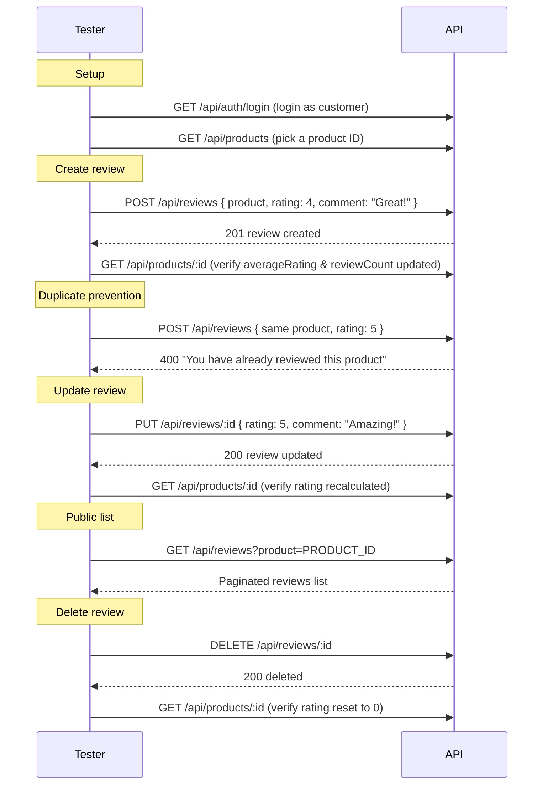

# Reviews Module — API Testing Guide

## Base URL

```
http://localhost:5000/api/reviews
```

**Public endpoints:** List, Get By ID
**Authenticated endpoints:** Create, Update, Delete

```
Authorization: Bearer <accessToken>
```

---

## 1. List Reviews (Public)

**Endpoint:** `GET /api/reviews`

**Query Parameters:**
| Param | Type | Description |
|---|---|---|
| `product` | ObjectId | Filter by product |
| `user` | ObjectId | Filter by user |
| `page` | number | Default: 1 |
| `limit` | number | Default: 20 |

**Success (200):**
```json
{
  "success": true,
  "data": {
    "reviews": [
      {
        "_id": "...",
        "user": { "_id": "...", "firstName": "John", "lastName": "Doe", "avatar": null },
        "product": "...",
        "rating": 4,
        "comment": "Great food!",
        "createdAt": "...",
        "updatedAt": "..."
      }
    ]
  },
  "pagination": {
    "total": 1,
    "page": 1,
    "limit": 20,
    "totalPages": 1
  }
}
```

---

## 2. Get Review By ID (Public)

**Endpoint:** `GET /api/reviews/:reviewId`

**Success (200):**
```json
{
  "success": true,
  "data": {
    "review": {
      "_id": "...",
      "user": { "_id": "...", "firstName": "John", "lastName": "Doe", "avatar": null },
      "product": { "_id": "...", "name": { "en": "Margherita Pizza", "ar": "بيتزا مارجريتا" } },
      "rating": 4,
      "comment": "Great food!",
      "createdAt": "..."
    }
  }
}
```

---

## 3. Create Review (Authenticated)

**Endpoint:** `POST /api/reviews`

**Headers:** `Authorization: Bearer <customerAccessToken>`

**Request Body:**
```json
{
  "product": "PRODUCT_ID",
  "rating": 4,
  "comment": "Great food!"
}
```

**Rules:**
- One review per user per product (enforced at database level with unique compound index)
- Rating must be between 1 and 5

**Success (201):**
```json
{
  "success": true,
  "message": "Review created",
  "data": {
    "review": {
      "_id": "...",
      "user": "...",
      "product": "...",
      "rating": 4,
      "comment": "Great food!",
      "createdAt": "..."
    }
  }
}
```

---

## 4. Update Review (Owner only)

**Endpoint:** `PUT /api/reviews/:reviewId`

**Headers:** `Authorization: Bearer <reviewOwnerAccessToken>`

```json
{
  "rating": 5,
  "comment": "Amazing!"
}
```

**Success (200):**
```json
{
  "success": true,
  "message": "Review updated",
  "data": {
    "review": {
      "_id": "...",
      "rating": 5,
      "comment": "Amazing!",
      "updatedAt": "..."
    }
  }
}
```

---

## 5. Delete Review (Owner only)

**Endpoint:** `DELETE /api/reviews/:reviewId`

**Headers:** `Authorization: Bearer <reviewOwnerAccessToken>`

**Success (200):**
```json
{
  "success": true,
  "message": "Review deleted",
  "data": null
}
```

---

## Rating Aggregation (Triggered Automatically)

Whenever a review is **created**, **updated**, or **deleted**, the service calls `updateProductRating()` which:

1. Runs `Review.aggregate` with `$avg` and `$sum` grouped by `product`
2. Updates `Product.averageRating` (rounded to 1 decimal) and `Product.reviewCount`
3. If no reviews remain, resets to `{ averageRating: 0, reviewCount: 0 }`

Verify by checking a product after review operations:

```json
{
  "success": true,
  "data": {
    "product": {
      "_id": "PRODUCT_ID",
      "averageRating": 4.5,
      "reviewCount": 2
    }
  }
}
```

---

## Edge Cases

| Scenario | Expected |
|---|---|
| Create review for non-existent product | **404** `Product not found` |
| Create second review on same product | **400** `You have already reviewed this product` |
| Create review with rating > 5 or < 1 | **400** validation error |
| Create review without auth | **401** Unauthorized |
| Update review not owned by user | **404** `Review not found or unauthorized` |
| Update with no fields changed | **200** — idempotent |
| Delete review not owned by user | **404** `Review not found or unauthorized` |
| Delete non-existent review | **404** |
| Get review by invalid ObjectId | **400** validation error |
| List with no filters | All reviews returned, paginated |
| List with `product` filter | Only reviews for that product |
| After delete → product rating resets to 0/0 | Aggregation handles empty group |
| Multiple users create reviews on same product | Each succeeds (one per user), rating aggregates all |

---

## Product Rating Lifecycle

```
Create Review  →  Review.aggregate  →  Product.averageRating = $avg  →  Product.reviewCount = $sum
Update Review  →  Review.aggregate  →  Product.averageRating = $avg  →  Product.reviewCount = $sum
Delete Review  →  Review.aggregate  →  Product.averageRating = $avg  →  Product.reviewCount = $sum
(no reviews)   →  (empty group)     →  Product.averageRating = 0     →  Product.reviewCount = 0
```

---

## Test Flow



---

## Seeded Data

| Collection | Count |
|---|---|
| Products | 22 |
| Reviews | 0 (create via API) |
