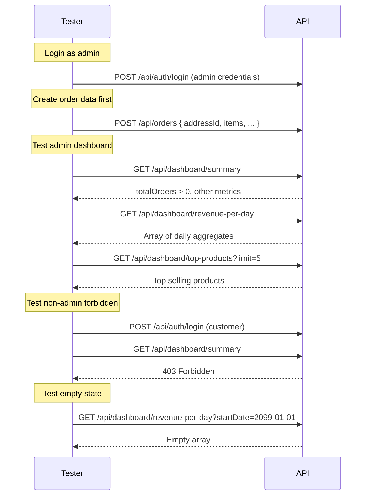

# Dashboard & Analytics Module — API Testing Guide

## Base URL

```
http://localhost:5000/api/dashboard
```

**All endpoints require admin authentication.**

```
Authorization: Bearer <adminAccessToken>
```

---

## 1. Summary (All Metrics)

**Endpoint:** `GET /api/dashboard/summary`

Returns 4 aggregate metrics in one call:

**Success (200):**
```json
{
  "success": true,
  "message": "Success",
  "data": {
    "totalOrders": 5,
    "totalRevenue": 450.50,
    "productsCount": 22,
    "usersCount": 3
  }
}
```

**Without `totalRevenue` (no paid orders):**
```json
{
  "success": true,
  "data": {
    "totalOrders": 5,
    "totalRevenue": 0,
    "productsCount": 22,
    "usersCount": 3
  }
}
```

---

## 2. Revenue Per Day

**Endpoint:** `GET /api/dashboard/revenue-per-day`

**Optional Query Parameters:**
| Param | Type | Description |
|---|---|---|
| `startDate` | ISO date | Filter from this date |
| `endDate` | ISO date | Filter to this date |

**All time:**
```
GET /api/dashboard/revenue-per-day
```

**Date range:**
```
GET /api/dashboard/revenue-per-day?startDate=2026-06-01&endDate=2026-06-30
```

**Success (200):**
```json
{
  "success": true,
  "message": "Success",
  "data": {
    "revenuePerDay": [
      {
        "_id": "2026-06-20",
        "revenue": 150.75,
        "count": 2
      },
      {
        "_id": "2026-06-22",
        "revenue": 105.00,
        "count": 1
      }
    ]
  }
}
```

---

## 3. Top Selling Products

**Endpoint:** `GET /api/dashboard/top-products`

**Query Parameters:**
| Param | Type | Description |
|---|---|---|
| `limit` | number | Number of products (default: 10) |

**Success (200):**
```json
{
  "success": true,
  "message": "Success",
  "data": {
    "topProducts": [
      {
        "_id": "665a1b2c...",
        "totalQuantity": 5,
        "totalRevenue": 400,
        "name": { "en": "Pepperoni Pizza", "ar": "بيتزا بيبروني" },
        "image": "...",
        "price": 100
      },
      {
        "_id": "665a1b2c...",
        "totalQuantity": 3,
        "totalRevenue": 240,
        "name": { "en": "Margherita Pizza", "ar": "بيتزا مارجريتا" },
        "image": "...",
        "price": 80
      }
    ]
  }
}
```

---

## Edge Cases

| Scenario | Expected |
|---|---|
| No orders in DB | `totalOrders: 0`, `totalRevenue: 0`, empty arrays |
| No paid orders yet | `totalRevenue: 0` (only paid orders counted) |
| No products | `productsCount: 0` |
| No customers in DB | `usersCount: 0` |
| `startDate` > `endDate` | Empty array (no orders match) |
| No orders with items sold | `topProducts` returns empty array |
| Limit = 5 but only 2 unique products sold | Returns 2 results |
| Non-admin JWT token | **403** Forbidden |
| No JWT token | **401** Unauthorized |
| Revenue per day with no matching dates | Empty array |
| Single day in revenue-per-day | Single entry with that day's aggregate |
| Multiple paid orders on same day | Single grouped entry with sum + count |

---

## Under the Hood (Aggregation Queries)

### Total Revenue
```
Order.aggregate [
  $match: { paymentStatus: 'paid' }
  $group: { _id: null, total: $sum totalAmount }
]
```

### Revenue Per Day
```
Order.aggregate [
  $match: { paymentStatus: 'paid', createdAt: { $gte: startDate, $lte: endDate } }
  $group: { _id: $dateToString format '%Y-%m-%d', revenue: $sum totalAmount, count: $sum 1 }
  $sort: { _id: 1 }
]
```

### Top Selling Products
```
Order.aggregate [
  $unwind: '$items'
  $group: { _id: items.product, totalQuantity: $sum quantity, totalRevenue: $sum quantity*price }
  $sort: { totalQuantity: -1 }
  $limit: N
  $lookup: join products on _id
  $project: _id, totalQuantity, totalRevenue, name, image, price
]
```

---

## Test Flow


