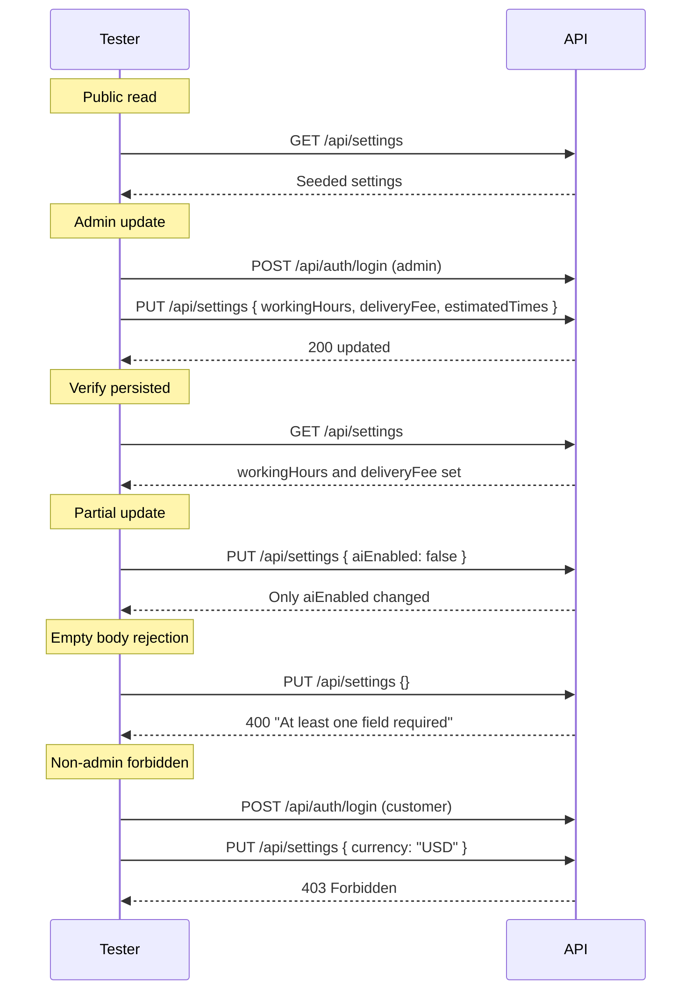

# Settings Module — API Testing Guide

## Base URL

```
http://localhost:5000/api/settings
```

**Public endpoint:** `GET /api/settings`
**Admin endpoint:** `PUT /api/settings`

```
Authorization: Bearer <adminAccessToken>
```

---

## 1. Get Settings (Public)

**Endpoint:** `GET /api/settings`

**Success (200):**
```json
{
  "success": true,
  "message": "Success",
  "data": {
    "settings": {
      "_id": "...",
      "restaurantName": {
        "en": "Electro Food",
        "ar": "إلكترو فود"
      },
      "logo": "",
      "supportEmail": "",
      "supportPhone": "",
      "facebookUrl": "",
      "instagramUrl": "",
      "tiktokUrl": "",
      "twitterUrl": "",
      "workingHours": "",
      "deliveryFee": 0,
      "estimatedTimes": "",
      "currency": "EGP",
      "defaultLanguage": "en",
      "aiEnabled": true,
      "createdAt": "...",
      "updatedAt": "..."
    }
  }
}
```

---

## 2. Update Settings (Admin only)

**Endpoint:** `PUT /api/settings`

**Headers:** `Authorization: Bearer <adminAccessToken>`

**Request Body (partial update — any combination):**

### Restaurant Info
```json
{
  "restaurantName": { "en": "Electro Food", "ar": "إلكترو فود" },
  "logo": "https://example.com/logo.png",
  "currency": "USD",
  "defaultLanguage": "ar"
}
```

### Working Hours
```json
{
  "workingHours": "Sat-Thu 10:00 AM - 11:00 PM, Fri 2:00 PM - 11:00 PM"
}
```

### Delivery Settings
```json
{
  "deliveryFee": 30,
  "estimatedTimes": "30-60 minutes"
}
```

### Social Links
```json
{
  "facebookUrl": "https://facebook.com/electrofood",
  "instagramUrl": "https://instagram.com/electrofood",
  "tiktokUrl": "https://tiktok.com/@electrofood",
  "twitterUrl": "https://twitter.com/electrofood"
}
```

### Contact Info
```json
{
  "supportEmail": "support@electrofood.com",
  "supportPhone": "+201000000000"
}
```

### AI Toggle
```json
{
  "aiEnabled": false
}
```

### Update All at Once
```json
{
  "restaurantName": { "en": "Electro Food", "ar": "إلكترو فود" },
  "workingHours": "Sat-Thu 10:00 AM - 11:00 PM",
  "deliveryFee": 25,
  "estimatedTimes": "30-60 min",
  "facebookUrl": "https://facebook.com/electrofood",
  "instagramUrl": "https://instagram.com/electrofood",
  "supportEmail": "support@electrofood.com",
  "supportPhone": "+201000000000",
  "currency": "EGP",
  "defaultLanguage": "en",
  "aiEnabled": true
}
```

**Success (200):**
```json
{
  "success": true,
  "message": "Settings updated",
  "data": {
    "settings": {
      "_id": "...",
      "restaurantName": { "en": "Electro Food", "ar": "إلكترو فود" },
      "workingHours": "Sat-Thu 10:00 AM - 11:00 PM",
      "deliveryFee": 25,
      "estimatedTimes": "30-60 min",
      "supportEmail": "support@electrofood.com",
      "currency": "EGP",
      "aiEnabled": true,
      "updatedAt": "..."
    }
  }
}
```

---

## Edge Cases

| Scenario | Expected |
|---|---|
| Empty body `{}` | **400** `At least one field must be provided for update` |
| Non-admin tries to update | **403** Forbidden |
| No JWT token for update | **401** Unauthorized |
| `deliveryFee` negative | **400** validation error (min 0) |
| `supportEmail` invalid format | **400** validation error |
| No settings document (after fresh DB wipe) | **404** `Settings not found` |
| Get settings without auth | **200** — public endpoint |
| Update only `aiEnabled` | Only that field changes, others preserved |
| Update `restaurantName.en` without `.ar` | Only `.en` updated, `.ar` preserved |
| Very long string values | Stored as-is (no maxLength validation) |

---

## 5 Groups Overview

| Group | Fields | Seeded Value |
|---|---|---|
| **Restaurant Info** | `restaurantName.en/ar`, `logo`, `currency`, `defaultLanguage` | Electro Food / إلكترو فود, EGP, en |
| **Working Hours** | `workingHours` | Empty (set via API) |
| **Delivery Settings** | `deliveryFee`, `estimatedTimes` | 0, Empty |
| **Social Links** | `facebookUrl`, `instagramUrl`, `tiktokUrl`, `twitterUrl` | Empty (set via API) |
| **Contact Info** | `supportEmail`, `supportPhone` | Empty (set via API) |
| **AI Toggle** | `aiEnabled` | `true` |

---

## Test Flow


