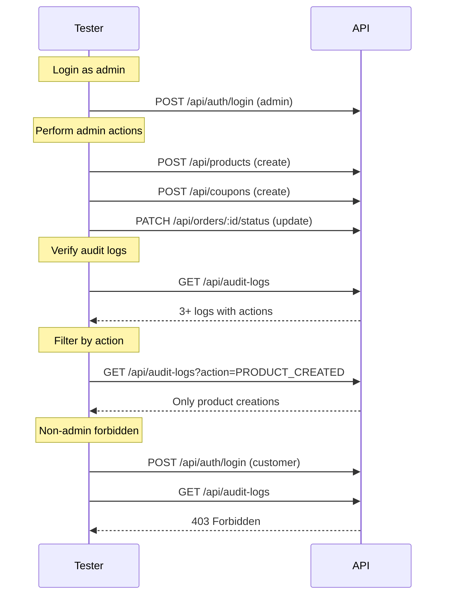

# Audit Logs Module — API Testing Guide

## Base URL

```
http://localhost:5000/api/audit-logs
```

**All endpoints require admin authentication.**

```
Authorization: Bearer <adminAccessToken>
```

---

## 1. List Audit Logs (Admin only)

**Endpoint:** `GET /api/audit-logs`

**Query Parameters:**
| Param | Type | Description |
|---|---|---|
| `action` | string | Filter by action name (e.g. `PRODUCT_CREATED`) |
| `entityType` | string | Filter by entity type (e.g. `Product`, `Order`, `User`) |
| `user` | ObjectId | Filter by admin user ID |
| `page` | number | Default: 1 |
| `limit` | number | Default: 20, max 100 |

**Success (200):**
```json
{
  "success": true,
  "data": {
    "logs": [
      {
        "_id": "...",
        "user": {
          "_id": "...",
          "firstName": "Admin",
          "lastName": "Electropi",
          "email": "admin@electropi.com"
        },
        "action": "ORDER_STATUS_UPDATED",
        "entityType": "Order",
        "entityId": "...",
        "metadata": {
          "from": "placed",
          "to": "confirmed"
        },
        "createdAt": "2026-06-24T03:30:00.000Z"
      }
    ]
  },
  "pagination": {
    "total": 7,
    "page": 1,
    "limit": 20,
    "totalPages": 1
  }
}
```

---

## Actions Automatically Tracked

| Action | Trigger | Middleware/Service |
|---|---|---|
| `LOGIN_SUCCESS` | User login | `auth.service.js` |
| `PRODUCT_CREATED` | Admin creates a product | `audit` middleware on `POST /api/products` |
| `ORDER_STATUS_UPDATED` | Admin updates order status | `order.service.js` |
| `USER_ROLE_CHANGED` | Admin changes user role | `auth.service.js` `updateUserRole` |
| `COUPON_CREATED` | Admin creates a coupon | `audit` middleware on `POST /api/coupons` |
| `COUPON_UPDATED` | Admin updates a coupon | `audit` middleware on `PUT /api/coupons/:couponId` |
| `COUPON_DELETED` | Admin deletes a coupon | `audit` middleware on `DELETE /api/coupons/:couponId` |
| `ZONE_CREATED` | Admin creates a zone | `audit` middleware on `POST /api/delivery-zones` |
| `ZONE_UPDATED` | Admin updates a zone | `audit` middleware on `PUT /api/delivery-zones/:zoneId` |
| `ZONE_DELETED` | Admin deletes a zone | `audit` middleware on `DELETE /api/delivery-zones/:zoneId` |
| `PRODUCT_UPDATED` | Admin updates a product | `audit` middleware on `PUT /api/products/:productId` |
| `PRODUCT_DELETED` | Admin deletes a product | `audit` middleware on `DELETE /api/products/:productId` |

---

## Audit Middleware Design

The `middlewares/audit.js` exports a factory function:

```js
audit(action, entityType, getEntityId?)
```

It intercepts `res.json()` and auto-logs the action when:
- Response status is < 400
- Response body has `success: true`

The `getEntityId` function extracts the entity ID from either:
- The request (`req.params.id`, `req.params.zoneId`)
- The response body (`body.data.product._id`, `body.data.coupon._id`)

---

## Edge Cases

| Scenario | Expected |
|---|---|
| No logs exist | Empty array, `total: 0` |
| Filter by specific action | Only matching actions returned |
| Filter by entity type | Only matching types returned |
| Non-admin access | **403** Forbidden |
| No JWT token | **401** Unauthorized |
| Audit middleware on failed mutation | Not logged (response status >= 400) |
| Audit middleware on non-200 success | Not logged |
| Multiple same actions on same entity | Each logged as separate entry |
| `metadata` field is optional | Some entries may have `metadata: {}` |

---

## Test Flow


