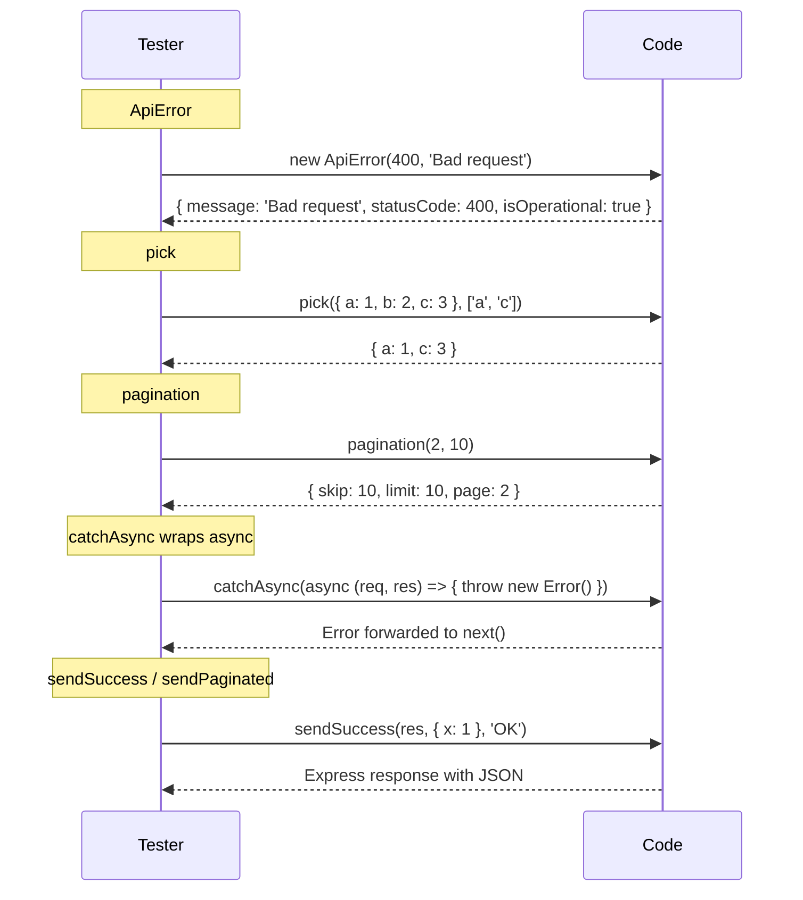

# Cross-cutting Utilities — Usage Guide

## Files in `backend/src/utils/`

| File | Export | Purpose |
|---|---|---|
| `apiError.js` | `class ApiError` | Custom error with `statusCode` and `isOperational` flag |
| `apiResponse.js` | `{ sendSuccess, sendError, sendPaginated }` | Standardized JSON response helpers |
| `catchAsync.js` | `function` | Wraps async route handlers to forward errors to Express |
| `pick.js` | `function` | Picks only allowed keys from an object |
| `pagination.js` | `function` | Computes `{ skip, limit, page }` from page/limit params |
| `email.js` | `{ sendEmail, sendVerificationEmail, ... }` | Nodemailer helpers |
| `io.js` | `{ init, getIO }` | Socket.IO singleton |
| `token.js` | `{ generateAccessToken, verifyToken, ... }` | JWT + crypto token utilities |

---

## 1. `ApiError` — `utils/apiError.js`

```js
const ApiError = require('../utils/apiError');

// In service files:
throw new ApiError(404, 'User not found');
throw new ApiError(400, 'Invalid input');
throw new ApiError(403, 'Forbidden');
```

**Properties:** `message`, `statusCode`, `isOperational = true`, `stack`

---

## 2. `sendSuccess` / `sendError` / `sendPaginated` — `utils/apiResponse.js`

```js
const { sendSuccess, sendError, sendPaginated } = require('../utils/apiResponse');

// Success — defaults: data=null, message='Success', statusCode=200
sendSuccess(res, { user }, 'User created', 201);
// → { success: true, message: "User created", data: { user: ... } }

// Error
sendError(res, 'Server error', 500);
// → { success: false, message: "Server error" }

// Paginated
sendPaginated(res, { products }, 100, 1, 20);
// → { success: true, data: { products }, pagination: { total: 100, page: 1, limit: 20, totalPages: 5 } }
```

---

## 3. `catchAsync` — `utils/catchAsync.js`

```js
const catchAsync = require('../utils/catchAsync');

// Wraps async handlers so thrown errors go to Express error middleware
const create = catchAsync(async (req, res) => {
  const user = await userService.create(req.body);
  sendSuccess(res, { user }, 'Created', 201);
});
```

---

## 4. `pick` — `utils/pick.js`

```js
const pick = require('../utils/pick');

const query = pick(req.query, ['name', 'price', 'page', 'limit']);
// req.query = { name: 'pizza', extra: 'foo', page: '1' }
// query    = { name: 'pizza', page: '1' }

// Also useful for filtering update bodies:
const allowed = pick(req.body, ['rating', 'comment']);
```

**Edge Cases:**

| Input | Result |
|---|---|
| `pick(null, ['a'])` | `{}` |
| `pick({ a: 1 }, null)` | `{}` |
| `pick({ a: 1 }, [])` | `{}` |
| `pick({ a: 1, b: 2 }, ['a', 'c'])` | `{ a: 1 }` (c not in source) |

---

## 5. `pagination` — `utils/pagination.js`

```js
const pagination = require('../utils/pagination');

// In service files:
const { skip, limit, page } = pagination(req.query.page, req.query.limit);

const items = await Item.find(filter).skip(skip).limit(limit);
const total = await Item.countDocuments(filter);
```

**Edge Cases:**

| Input | Output |
|---|---|
| `pagination(1, 20)` | `{ skip: 0, limit: 20, page: 1 }` |
| `pagination('1', '20')` | `{ skip: 0, limit: 20, page: 1 }` (string coerced) |
| `pagination(0, 20)` | `{ skip: 0, limit: 20, page: 1 }` (clamped to 1) |
| `pagination(3, 200)` | `{ skip: 200, limit: 100, page: 3 }` (clamped to maxLimit=100) |
| `pagination(-5, 0)` | `{ skip: 0, limit: 20, page: 1 }` (defaults) |
| `pagination()` | `{ skip: 0, limit: 20, page: 1 }` (no args → defaults) |

---

## 6. Other Utilities (already documented elsewhere)

| Utility | Key Export | Used In |
|---|---|---|
| `email.js` | `sendVerificationEmail`, `sendResetPasswordEmail` | Auth service |
| `io.js` | `init(server)`, `getIO()` | Server bootstrap + notification service |
| `token.js` | `generateAccessToken`, `generateRefreshToken`, `verifyToken`, `generateEmailVerificationToken`, `generateResetPasswordToken` | Auth service |

---

## Usage in Services (current patterns that can be simplified)

### Before (`pagination` inline in every service):

```js
// Repeated in 6+ service files:
const page = parseInt(req.query.page, 10) || 1;
const limit = parseInt(req.query.limit, 10) || 20;
const skip = (page - 1) * limit;
```

### After:

```js
const pagination = require('../utils/pagination');
const { skip, limit, page } = pagination(req.query.page, req.query.limit);
```

---

## Test Flow



---

## Seeded Data

No database entities — these are pure utility modules with no schema or persistence.
